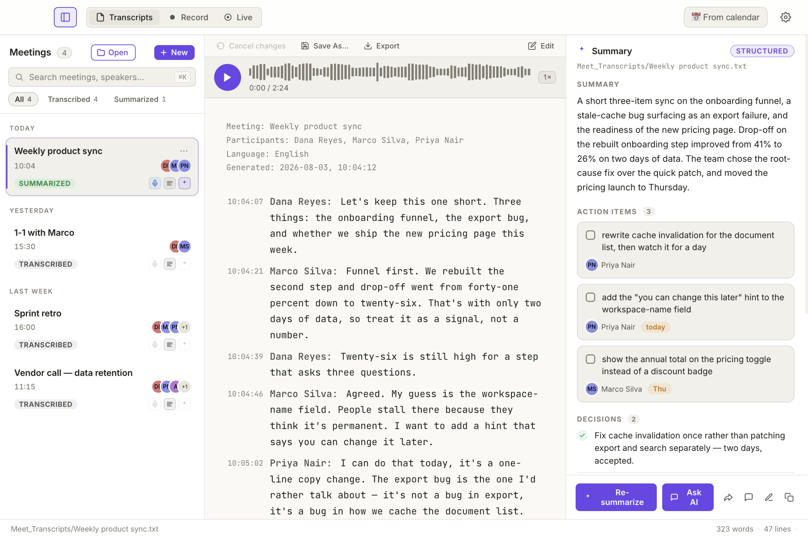
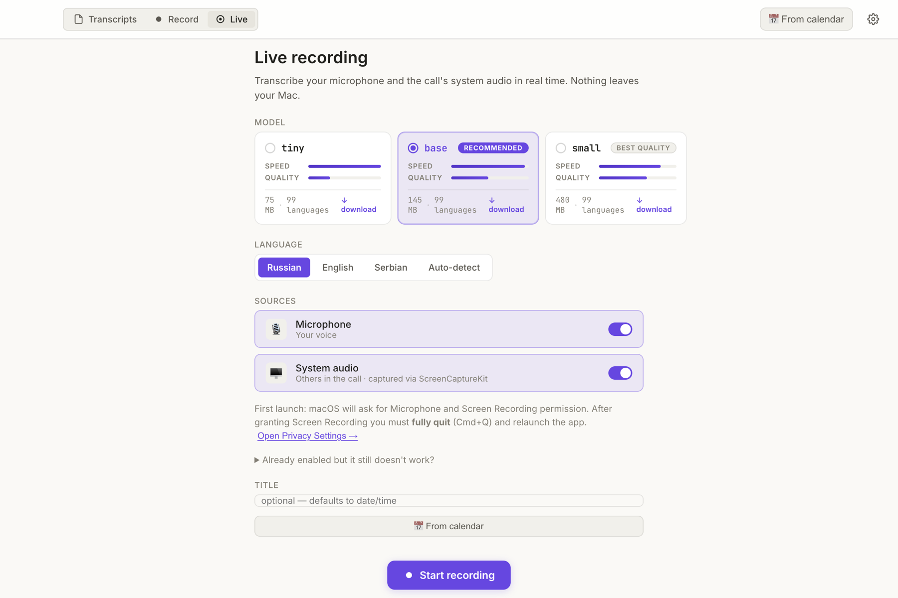
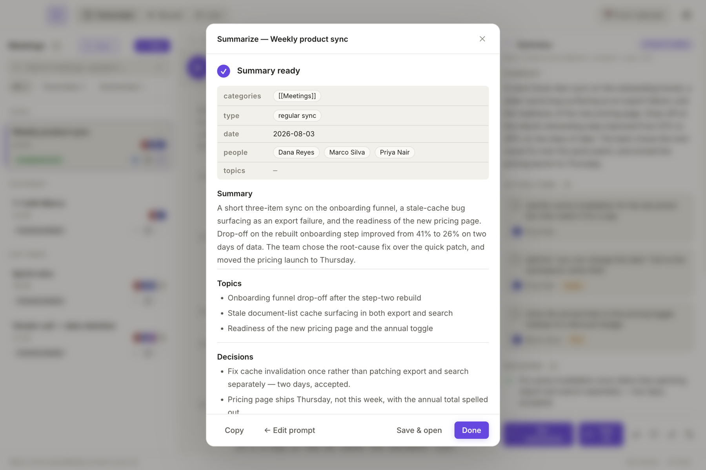

# Unlimeety — private, on-device transcription & summarization

A macOS app that records and transcribes any audio — meetings, calls, interviews, voice notes —
**entirely on your Mac**. Speech recognition and speaker diarization run locally through
WhisperKit / CoreML: no audio ever leaves the machine, no account, no per-minute pricing, no bot
joining your call. Summarization is then done by an LLM of your choice, and that choice can be a
local one too.

**Written entirely by AI** · **on-device** · **free** · **MIT** · **macOS, Apple Silicon**

[](https://github.com/cardpay/unlimeety/releases/latest/download/Unlimeety-arm64.dmg)



A small Chrome extension for Google Meet ships alongside it, but it is one capture path out of
three — the desktop app is where the actual work happens.

---

## Built entirely by AI

Unlimeety is a product built with no human writing code. Not "AI-assisted" — AI-built,
end to end:

| Stage | Who did it |
|---|---|
| Product design, UI, visual language | **Claude Design** |
| Architecture and technical decisions | **Claude Code** |
| Implementation — Electron app, Swift/CoreML helper, Chrome extension | **Claude Code** |
| Code review | **Claude Code** |
| Pre-release security audit and the fixes it produced | **Claude Code** |
| Documentation, including this README | **Claude Code** |

A human stayed in exactly one role: product owner. Stating intent, using the result, saying
*no, do it properly* — and never opening an editor.

**How it was actually run**, because the process is the interesting part:

- **One git worktree per feature.** Agents worked in parallel on isolated checkouts —
  live-audio capture, meeting auto-detection, the light theme, auto-stop at end of call,
  bulk transcription — and each landed as its own merge.
- **A pipeline, not a chat.** Specialised subagents in sequence: architect → implementer →
  reviewer, each with its own context and its own definition of done.
- **A security audit before going public.** A dedicated agent pass audited the whole
  codebase for an open-source release — path traversal, IPC sender validation, key storage,
  the summary write path — and its critical and high findings were fixed before the first
  public commit.
- **~22 300 lines of product code** (JavaScript, Swift, CSS, HTML), 239 commits over
  four and a half months, from empty directory to a signed and Apple-notarized app in
  daily use.

This is the part worth taking away: an AI-first engineering loop produced not a demo but a
notarized desktop application with on-device ML, a real transcript library, and a
privacy posture strict enough to publish. At Unlimit, that's what "AI-first" is expected to
mean in practice.

---

## Why it exists

Meeting transcription today usually means a bot joining your call, an account, a per-minute
bill, and your recordings sitting on someone else's server — which is exactly what makes it a
non-starter for a customer call, a salary conversation, a legal review or an incident
post-mortem.

Unlimeety takes the other side of every one of those trade-offs:

|  | Typical SaaS transcriber | Unlimeety |
|---|---|---|
| Where audio goes | Vendor's cloud | Never leaves your Mac |
| Who joins the call | A bot other participants can see | Nobody |
| Account | Required | None |
| Cost | Per minute or per seat | Free, MIT-licensed |
| Works offline | No | Yes, including the summary if you point it at a local model |

The niche it closes: confidential conversations you cannot legally or comfortably send to a
third party — and everything else you'd rather not pay per minute for.

## How it works

Three ways to get a transcript, all landing in the same library:

| | Path | Use it for |
|---|---|---|
| 🎙 | **Live tab** | Any app — Zoom, Teams, Slack huddles, a browser tab, a room. Mic + system audio transcribed in real time, with live speaker diarization. |
| ⏺ | **Record tab** | Record now to `.wav`, transcribe later with a big model. Also imports existing audio files. |
| 🧩 | **Chrome extension** | Google Meet only. Reuses Meet's own captions (no audio capture at all) and hands the file to the desktop app. |

Whichever path you took, from there it's the same transcript: edit it, bind real names to speakers,
re-transcribe it with a better model, summarize it from one of seven templates, chat with it, draft
the follow-up, export or share it.

---

## What it does

**Live transcription & diarization**



- Microphone and system audio captured together, each toggleable on its own, with live level meters.
- Partial hypotheses appear greyed out and are re-decoded every ~700 ms, then finalized on ~1 s of
  silence — you read the text as it settles, not in chunks.
- Speaker turns via SpeakerKit / pyannote 3.1, re-run every ~30 s while recording: placeholder `S?`
  labels resolve to real turns live, with one authoritative pass on **Stop**.
- Speakers get readable phonetic names (Alpha, Bravo, …). Click a speaker chip to bind the real
  name — it is written into both the transcript body and the `Participants:` header.
- Every live session also writes a lossless `.wav`, paired with the transcript by filename.
- VAD gating plus a hallucination blocklist, so silence doesn't produce `[music]` or "thanks for
  watching".

**Audio ↔ transcript sync, both directions**
- Click any line of the transcript to seek the audio there.
- During playback the current line highlights and follows along.
- Waveform with click-to-seek and playback-speed cycling.

**Automatic meeting detection**
- Notices when a call starts by asking Core Audio whether the input device is in use — it never
  opens the microphone itself and needs no extra permission for this. Music playing doesn't trigger
  it; a conferencing app holding the mic does.
- Recognizes Zoom, Teams, Slack, FaceTime, WhatsApp, Discord, Webex and the major browsers.
- Offers to record from a floating panel that stays visible **above full-screen apps** — including a
  full-screen Zoom call. Title is pre-filled from the calendar event happening right now.
- **Auto-stop when the meeting ends**: detects the call dropping and stops recording after a 15 s
  grace period you can cancel. Both behaviours are on by default and switchable from the menu bar.

**Calendar-aware**
- Reads the current event's title and participants to fill in the transcript header.
- Suggests the right capture mode from the event's conferencing link: Meet/Zoom/Teams/Webex/Jitsi/
  Whereby → Live tab, no link at all → Record tab for an in-person meeting. For Meet it also mentions
  the Chrome extension as an alternative. It suggests; it never starts recording on its own.

**Improving a transcript after the fact**
- Re-transcribe any recording with a larger model straight from the library.
- Batch-transcribe a whole selection of recordings in one go, with ETA per file.
- Save named settings presets, and tune expected speaker count, merging of adjacent same-speaker
  turns, initial prompt, temperature and the Silero VAD filter.
- Rename speakers, edit text inline, or regenerate the summary.
- **Enhance** (meeting menu, right-click a meeting) runs the configured summarizer model over the
  spoken text to fix recognition errors, punctuation and casing, and to restore domain terms from
  **Settings → Domain glossary** (one term per line; known mishearings after a tab, e.g.
  `PayCore⇥пейкор⇥пей кор`). Your own `Note:` lines are never sent; timestamps and speaker labels
  are sent as anchors but are never rewritten. It **overwrites the transcript in place, with no
  backup** — a part the model answers badly is left exactly as it was, if the whole reply is
  unusable nothing is written at all, and while the note is open **Cancel changes** reverts the
  whole run for the rest of the session. Same provider as summarization, so the same privacy note
  applies.

**Summarize, chat, share**



- Seven built-in prompt templates — Meeting, Daily, Interview, 1-1, Retro, Project, Negotiations —
  plus your own saved prompts.
- The Meeting template emits Obsidian-ready YAML frontmatter and infers real names from what was
  actually said.
- **Chat with the transcript** (⌘/) — including a live one that is still growing.
- Draft the follow-up e-mail from summary + transcript.
- Share to Email, Slack (converted to Slack markup), Telegram or clipboard.
- Export PDF, DOCX, Markdown, plain text, and the `.wav`.

**Library**
- Grouped by date, full-text search with snippets, live folder watching.
- Filter by work left to do: `All`, `To re-transcribe` (has audio and came from a model less
  accurate than `large-v3` — a transcript with no `Model:` line is never queued),
  `To enhance` (has spoken turns, never enhanced), `To summarize` (no summary on disk).
  A transcript that cannot be read appears under `All` only.
- Delete granularly — just the audio, just the transcript, just the summary, or everything.
- Drag & drop, double-click in Finder via the `unlimeety://` handler, dark theme by default.

**Models**
- Six Whisper variants, 99 languages each, from `tiny` (74 MB, ~20× realtime) to `large-v3` (2.9 GB,
  ~3×). Download and delete them from inside the app.
- The Live tab deliberately offers only the three smallest — real-time cares about latency far more
  than the last few percent of accuracy. The Record tab defaults to the largest.

**Odds and ends**
- Lives in the menu bar: close the window and meeting detection keeps working.
- Hotkeys: `⌘S` save, `⌘⇧S` save as, `⌘O` open, `⌘N` new, `⌘K` search, `⌘R` Record tab, `⌘/` chat,
  `⌘⏎` create + summarize.

---

## Installation (no coding required)

### Step 1. Install the desktop app

1. Download the `.dmg`: [Unlimeety-arm64.dmg](https://github.com/cardpay/unlimeety/releases/latest/download/Unlimeety-arm64.dmg)

   All releases: [github.com/cardpay/unlimeety/releases](https://github.com/cardpay/unlimeety/releases).

   **Requires a Mac with Apple Silicon** (M1 or newer) running macOS 14.2+. Intel Macs are not supported — the on-device transcription helper is built for arm64 only. Check with the Apple menu → **About This Mac**: "Chip" should say *Apple M…*.
2. Double-click the downloaded `.dmg` file
3. Drag **Unlimeety** into the **Applications** folder (or `~/Applications`)
4. Close the `.dmg` window
5. Open **Unlimeety** from Launchpad or Finder

> On first launch macOS briefly verifies the app with Apple ("Verifying Unlimeety…"). This is normal — the app is signed with a Developer ID certificate and notarized by Apple. After verification it opens immediately, with no extra clicks in System Settings required.

### Step 2. Grant macOS permissions (first launch only)

The app needs two permissions for the **Live** tab (real-time on-device transcription). They can be granted later, but it's easier to do up front:

- **Microphone** — to capture your voice.
- **System Audio Recording Only** — to capture audio from Zoom / Meet / Teams / browser tabs. The app
  does not need, and does not ask for, screen recording: grant the *audio-only* variant.

Open **System Settings → Privacy & Security**, find both items in the left rail, and toggle **Unlimeety** on. macOS will ask you to quit and relaunch the app — do it. If system audio recording isn't granted, the Live tab will tell you exactly what to enable.

> If you only use the Chrome extension (captions, not on-device transcription), these permissions are not required.

### Step 3. First launch — Whisper model download

The first time you start a session, Unlimeety downloads the selected Whisper model into `~/Library/Application Support/Unlimeety/models/whisperkit/`. The **Live** tab defaults to `base` (142 MB); the **Record** tab defaults to `large-v3` (2.9 GB) since it transcribes offline and can afford the accuracy. This happens once per model; later sessions reuse the cache. A progress indicator is shown while it downloads — be on Wi-Fi for the first run.

### Step 4. Install the Chrome extension (optional — Google Meet only)

Skip this unless you specifically want the caption-based Meet path; the desktop app handles Meet
through the Live tab like any other call.

1. Download and unzip the extension folder (get it from whoever maintains the project)
2. Open Chrome and go to `chrome://extensions/`
3. Enable the **Developer mode** toggle in the top-right corner
4. Click **Load unpacked**
5. Select the `extenstion` folder (yes, the typo is intentional)
6. The extension will appear in the list — make sure it is enabled

> For convenience, pin the extension: click the puzzle icon to the right of the address bar and click the pin next to **Unlimeety**.

### Step 5. Configure the summarizer (optional)

Transcription is always local. The summarizer model is the one place a cloud service can be involved — and only if you pick one. It serves Summarize, Ask AI, follow-up drafts and **Enhance**, so with a cloud provider the transcript text of those runs leaves the Mac. Four providers, in **Settings → Summarizer**:

- **Claude Code** *(default)* — uses the `claude` CLI installed on your machine. See [Claude Code docs](https://docs.anthropic.com/en/docs/claude-code/overview). If `claude` is not in `PATH`, the app will tell you so on the first run.
- **Ollama** — fully local models, nothing leaves the Mac. Requires a running `ollama serve` at `http://localhost:11434` and a pulled model (default `llama3.1`).
- **OpenRouter** — paste an API key from [openrouter.ai](https://openrouter.ai/), pick a model (default `anthropic/claude-3.5-sonnet`).
- **OpenAI-compatible** — any base URL that speaks the OpenAI API, for self-hosted or corporate gateways.

API keys are encrypted with Electron `safeStorage` (Keychain on macOS).

### Step 6. Usage

**Capturing** — three independent paths:

- **Live tab** (any app — Zoom, Teams, Meet, a browser, a room): open Unlimeety → **Live** tab → pick language and model → **Start**. Mic and system audio are transcribed and diarized locally; **Stop** saves the transcript plus the `.wav`. Or just wait: if auto-detect is on, Unlimeety offers to start recording the moment a call begins.
- **Record tab**: records to `.wav` without live transcription — transcribe later from the library with a bigger model, or batch-transcribe several recordings at once. Also imports existing audio files.
- **Chrome extension** (Google Meet only, uses Meet's captions): join a call → the **Unlimeety** panel appears bottom-right → pick a language (Russian / English / Serbian) → click **record**. On **Save** or when you leave the call, the transcript lands in `~/Downloads/Meet_Transcripts/` and opens in the desktop app.

**Then, in the app:** edit the transcript, bind real names to speakers, re-transcribe with a better
model, **Summarize** into `<name>.summary.md` (YAML frontmatter + Markdown, Obsidian-friendly), chat
with the transcript (`⌘/`), draft the follow-up, export or share it. See
[What it does](#what-it-does) for the full set.

---

## Components

### `desktop/` — Desktop App (Electron + Swift helper)

The main application: capture, on-device transcription and diarization, transcript library, editor,
summarization. Feature list is in [What it does](#what-it-does) above.

Under the hood, everything speech-related runs in a Swift helper process built on
[`argmax-oss-swift`](https://github.com/argmaxinc/argmax-oss-swift) (WhisperKit + SpeakerKit, CoreML)
— which is why the interesting half of the app is Apple-Silicon-only. Electron handles the UI, the
library and the LLM calls.

---

### `extenstion/` — Chrome Extension

A Manifest V3 extension for Google Meet, and only Google Meet. It does no audio capture and no speech
recognition of its own: it reads Meet's own caption panel via `MutationObserver` and writes a
transcript file, then opens it in the desktop app through the `unlimeety://` protocol. It makes zero
network requests. Useful when you'd rather not record audio at all — otherwise the Live tab is
strictly more capable.

Caption language: Russian, English or Serbian. Detects participants and attributes lines to them,
auto-saves when you leave the call. The panel's Note field takes freeform notes while recording —
Enter drops one into the transcript as a `[time] Note:` line, the same marker the desktop Live and
Record tabs write, so a shared summarizer prompt recognizes either source.

**Saved file format** (the desktop app writes the same header, plus a `Model:` line naming the
WhisperKit model that produced the text and, once **Enhance** has run over it, an `Enhanced:`
timestamp — the Transcripts list shows both as chips on the meeting card):
```
Meeting: Weekly sync
Participants: Alice, Bob, Carol
Language: English
Generated: 2026-03-19, 14:30:00

[14:30:05] Alice:
Let's start with the weekly tasks.

[14:30:12] Bob:
Sounds good, I have an update on the project.

[14:30:20] Note:
ask Bob about the staging rollout date
```

---

## For developers

### Requirements

**All platforms:**
- Node.js >= 18
- npm

**macOS only** (needed for the Live tab — Swift helper that runs WhisperKit/SpeakerKit):
- macOS 14.2 or newer on Apple Silicon (the `live-helper` package declares `.macOS("14.2")` and builds arm64-only)
- Xcode Command Line Tools (`xcode-select --install`) — provides Swift 5.9+
  - For a fresh install of the full Xcode app: `xcode-select -s /Applications/Xcode.app/Contents/Developer`
- First `swift build` will fetch and compile [`argmax-oss-swift`](https://github.com/argmaxinc/argmax-oss-swift) (WhisperKit + SpeakerKit). Expect 3–10 min and a few hundred MB in `live-helper/.build/`.

> **Windows / Linux** builds skip the Swift helper entirely — the Live tab is macOS-only by design. Editor, library and summarization still work.

### Run the desktop app in dev mode

```bash
cd desktop
npm install

# macOS: build the Swift helper once before the first run (needed only if you use the Live tab in dev)
npm run build:helper

npm start          # or: npm run dev   (opens DevTools)
```

The helper binary lives at `desktop/live-helper/.build/release/unlimeety-live`. Rebuild it with `npm run build:helper` after editing any `*.swift` file under `live-helper/Sources/`.

### Build the desktop app

```bash
cd desktop
npm install

# macOS — Apple Silicon (~230 MB installed)
npm run build:mac
# same, explicit:
npm run build:mac:arm64

# Windows / Linux (no Live tab — Swift helper is skipped automatically)
npm run build:win
npm run build:linux
```

Every macOS build runs `npm run build:helper` first (`swift build -c release` inside `live-helper/`) and bundles the resulting binary into `Unlimeety.app/Contents/MacOS/unlimeety-live`. If Swift is not on `PATH`, the macOS build fails fast. The helper is arm64-only, so there is no Intel or universal macOS target.

Artifacts land in `desktop/dist/` as `Unlimeety-arm64.dmg` — the name carries no version, so the `releases/latest/download/...` URL above stays valid across releases.

To install the built app into `~/Applications`:

```bash
cp -r desktop/dist/mac-arm64/Unlimeety.app ~/Applications/
```

### Code signing

The app is signed with a *Developer ID Application* certificate (UNLIMINT EU LTD) with hardened runtime enabled, and both the `.app` and the `.dmg` are notarized by Apple — so users get no "unidentified developer" warning. Building a distributable therefore needs an Apple Developer account and a notarytool keychain profile; see [desktop/RELEASE.md](desktop/RELEASE.md) for the full setup. Without the certificate in the login keychain the `build:helper` step fails at `codesign`; without `APPLE_KEYCHAIN_PROFILE` the build completes but notarization is skipped.

### Load the extension for development

1. `chrome://extensions/` → enable **Developer mode**
2. **Load unpacked** → select the `extenstion/` folder
3. After making changes, click the refresh button on the extension card

### Project structure

```
unlimeety/
├── extenstion/                # Chrome Extension (Manifest V3)
│   ├── manifest.json          # Extension config
│   ├── background.js          # Service worker: storage and download
│   ├── content.js             # Widget and caption capture
│   └── content.css            # Widget styles
└── desktop/                   # Electron app
    ├── main.js                # Main process
    ├── preload.js             # IPC bridge
    ├── renderer/              # UI
    │   ├── index.html
    │   ├── app.js
    │   └── style.css
    └── package.json
```

## Security & privacy notes

- **All processing is local by default.** Transcription (WhisperKit) and diarization run
  on-device; the browser extension saves transcripts to local files only and makes no
  network requests.
- **Cloud LLM providers are opt-in.** The default summarization provider is the local
  `claude` CLI. If you configure a cloud provider (OpenRouter / OpenAI-compatible),
  transcript text is sent to that provider's API over HTTPS.
- **API key storage.** Provider API keys are encrypted with Electron `safeStorage`
  (Keychain on macOS, DPAPI on Windows). On Linux systems without a secret service,
  the key falls back to plaintext in the app's `config.json`.
- **ML model integrity.** Whisper/diarization models are downloaded from Hugging Face
  (`argmaxinc/whisperkit-coreml`, `argmaxinc/speakerkit-coreml`) over HTTPS; per-file
  checksum pinning is not implemented.
- **Calendar access.** With calendar integration enabled, the app reads event titles,
  participant names, and — when a name is unavailable — participant e-mail addresses
  to build the transcript header. This data stays local unless a cloud LLM provider
  is configured.

## License

Released under the [MIT License](./LICENSE).

Third-party components (fonts, npm and SwiftPM dependencies) are listed with their
licenses in [`THIRD_PARTY_LICENSES.md`](./THIRD_PARTY_LICENSES.md). Bundled fonts
(Inter, JetBrains Mono) are under the SIL Open Font License 1.1.

## Trademarks

The MIT License covers the source code only. "Unlimeety", the name "Unlimit", and the
Unlimit logo (`extenstion/2025_Unlimit_Sign_black.jpg`) are trademarks of Unlimit Holding EU Ltd
and are **not** licensed under the MIT License. Forks and derivative works
must not use these names or logos in a way that implies endorsement by, or affiliation
with, Unlimit Holding EU Ltd or any member of the Unlimit Group.
